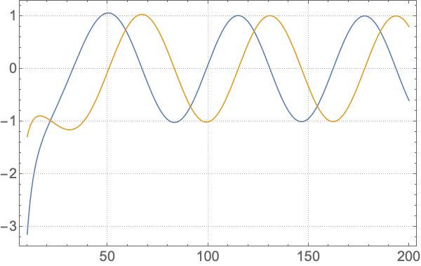



# ReggeWheeler

A Mathematica package for computing solutions to the ReggeWheeler equation. Note this package depends upon the [SpinWeightedSpheroidalHarmonics](https://bhptoolkit.org/SpinWeightedSpheroidalHarmonics/) and [KerrGeodesics](https://bhptoolkit.org/KerrGeodesics/) packages to run.

Explicitly the package computes solutions to the Regge-Wheeler equation:

$$ f^2 \frac{d^2\Psi}{dr^2} + f f' \frac{d\Psi}{dr} + [\omega^2 - U_l(r)]\Psi = \mathcal{T} \nonumber $$

where the potential is given by

$$ U_l(r) = \frac{f}{r^2}\left( l(l+1) -\frac{6M}{r} \right) \nonumber $$

where $f = 1-2M/r$, a prime denotes differentiation w.r.t. $r$,  
$M$ is the black hole mass,  
$\omega$ is the mode frequency,  
$\Psi$ is the Regge-Wheeler master variable,  
and $\mathcal{T}$ is the source.


Currently the source has been implement for a point particle moving along a circular geodesic orbit. As an example, the flux of gravitational waves in this case for the $l=2,m=2$ mode is easily computed using:

```
r0 = 10`30;
orbit = KerrGeoOrbit[0, r0, 0, 1];

s = 2; l = 2; m = 2; n = 0;
mode = ReggeWheelerPointParticleMode[s, l, m, n, orbit];
```
The `mode` variable is now a `ReggeWheelerMode` object which can be queried for interesting results. For the energy and angular momentum flux use `mode["Fluxes"]` which returns 
```
<|"Energy" -> <|"I" -> 0.000026843977395510576377, "H" -> 5.6541387345369358451*10^-9|>, "AngularMomentum" -> <|"I" -> 0.00084888110027888050954, "H" -> 1.78799566077188627708*10^-7|>|>
```

Note the high precision of the input value of $r_0$. This is required by default as the package uses the MST method to calculate the homogeneous solutions.

## Homogeneous solutions

You can compute just the (homogeneous) radial solutions using `ReggeWheelerRadial[s,l,ω]` function. Currently two methods are implemented for computing the homogeneous radial solutions. These use either the semi-analytic MST or direct numerical integration methods. You can switch between using the `Method` option as detailed below. The `ReggeWheelerRadial` function returns a `ReggeWheelerRadialFunction` (or an Association of them).


### MST

This is the default method and the example flux calculation given above is using it. The method works well for high precision results, but note that (currently) it needs high precision input to work correctly (a warning will be given if you use machine precision input). It is also slower to evaluate than the numerical integration method. You can explicitly use the method by passing the `Method->"MST"` option. By default this method computes both the "In" and the "Up solutions". You can choose to calculate just one or the other by passing the e.g., "BoundaryConditions" -> "Up" option.

### Numerical integration

The numerical integration method can be used via, e.g.,

```
RW = ReggeWheelerRadial[2, 2, 0.1, Method -> {"NumericalIntegration", "Domain" -> {10, 10^4}}, "BoundaryConditions" -> "Up"]
```
for the "Up" solution. Note you have to set the integration "Domain". The resulting `ReggeWheelerRadialFunction` can be rapidly evaluated (though this method is not as effective for beyond machine precision results.)

You can plot the real and imaginary parts of the above radial solution using `Plot[RW[r] // ReIm // Evaluate, {r, 10, 200}, PlotTheme -> "Detailed",
  PlotLegends -> None, BaseStyle -> 20]`. This gives:
  
  <p align="center"></p>

